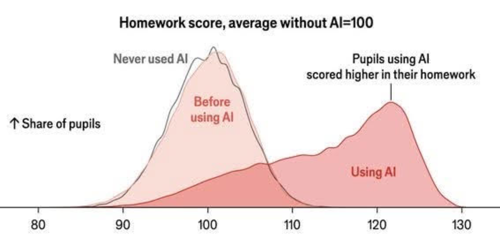
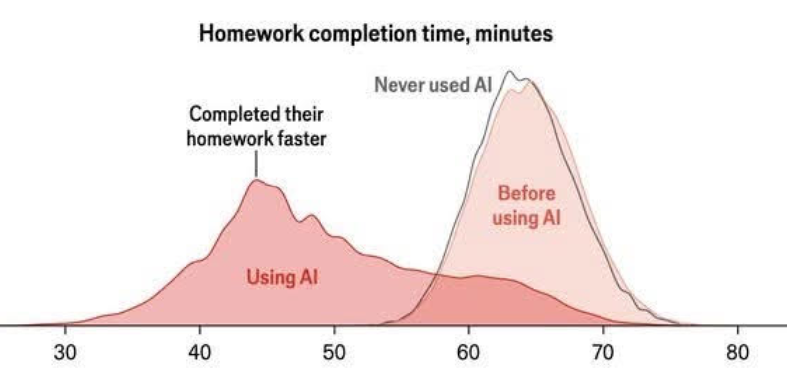
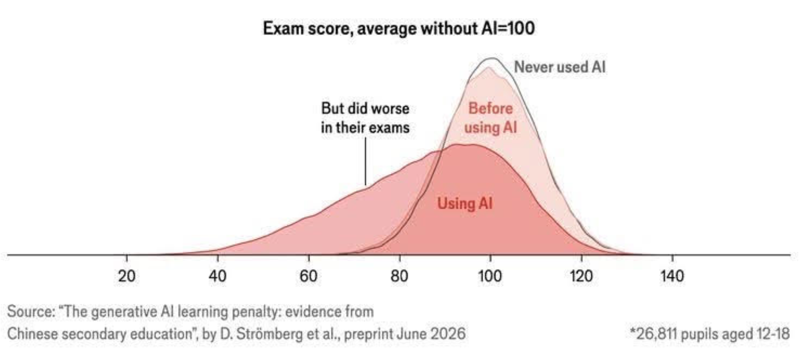
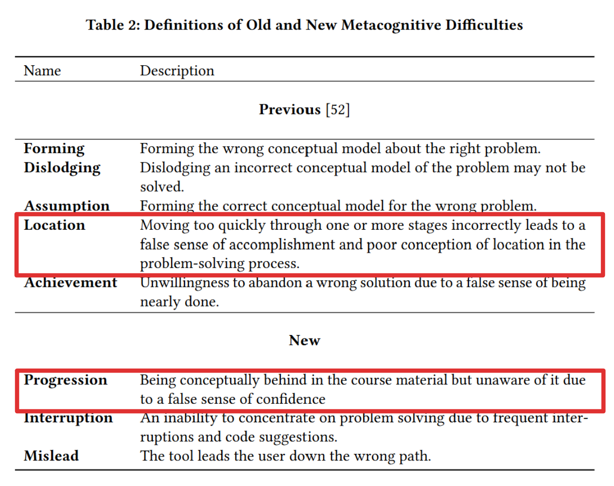

# Course Introduction

## Course Introduction

Instructor: Dr. Adam Labadorf

Times: MWF 12:20-2:05

Location: CDS B62

TAs: Mae Rose Gott (gott@bu.edu), others TBA

Course website: [bu-cds-bf550.github.io](https://bu-cds-bf550.github.io)

## Learning Objectives

Learning objectives:

::: {.incremental}
- **frame** biological questions as statistical *estimation* problems
- **understand the broad classes of machine learning (ML) algorithms**, with some specific, common exemplars
- **develop intuition** for which ML algorithms are suitable for answering which problems
- **generate code** by steering coding agents and **verify** the code's correctness
- **read and understand** code generated by others, including code created by your coding agent
:::

## First offering

This is a **new** course. There may be some adjustments.

. . .

This course utilizes *computational thinking pedagogy*:

1. **Frame** the biological question as a process that generated data
2. **Decompose** the problem into computable components
3. **Select** appropriate methods to estimate the answer
4. **Anticipate** how the answers you compute might be incorrect

## How the course runs

- **Assigned reading:** one chapter of the [textbook](https://bu-cds-bf550.github.io/bf550-textbook/).
  This week: [chapter 1](https://bu-cds-bf550.github.io/bf550-textbook/chapters/ch01-simulating-a-process.html).
- **One problem set a week**
- **Every question states its AI level.** 
- Every class meeting will have:
  - a digital checkin (5-10 minutes)
  - a lecture portion
  - a lab session
- **Exams:** in-class midterm, and short Act III exam
- Dates, rooms, policies: the [course site](https://bu-cds-bf550.github.io/).

## The arc: what is unknown?

Three acts, organized by one escalating question — *what is unknown, and how would you know your
answer is right?*

- **Act I — the unknown is a number** (weeks 1–3)
- **Act II — the unknown is an answer you have examples of** (weeks 4–9)
- **Act III — nobody gives you the answer** (weeks 10–12)

## The Bet This Course Makes

Central bet:

> in a world where large language models write code, it is more
> important to **read** and **verify** code than **write it** ourselves

. . .

You are provided Claude Pro subscriptions to use throughout the course for:

- brainstorming
- code generation

## AI Assessment Scale (AIAS)

This course uses a modified [AI Assessment Scale](https://aiassessmentscale.com/)

| Level | What it means in practice |
| --- | --- |
| AIAS 1 | No AI use even for brainstorming. We are interested in your thoughts and words. |
| AIAS 2 | You can use AI for brainstorming and organizing your thoughts, but no content should leave your chat |
| AIAS 3 | You can use AI for brainstorming and organizing your thoughts, and you may copy and paste output with attribution  |
| AIAS 4 | AI can author content, you should attempt to structure and guide the LLM with appropriate documentation |
| AIAS 5 | AI can author content with minimal guidance or supervision |

: {tbl-colwidths="[20,80]"}

The Bioinformatics Program has developed its own [AI Usage Policy](https://github.com/bu-bioinfo-classrooms/bioinfo-shared-setup/blob/main/docs/01-general-policies/README.md)

## Assignments

- One assignment per week, first assigned today
- Delivered and submitted through GitHub
- Materials are Jupyter notebooks you complete
- Due by commit+push to GitHub before class the following week
- Each assignment has three sections in each:
  - Warm-up exercises
  - Design - apply computational thinking to a problem
  - Build - Implement and test design from the week before

## Course Technologies

::: {.incremental}
- We will use [SCC](https://www.bu.edu/tech/support/research/computing-resources/scc/) and [VSCode](https://www.bu.edu/tech/support/research/software-and-programming/common-languages/python/python-editing/code-server/)
- Assignments are delivered and submitted on GitHub
- Daily check-ins use [socrative](https://www.socrative.com/)
- Install [Claude Desktop](https://claude.com/download) on your own computer
- We will install [claude code](https://claude.com/product/claude-code) on SCC
:::

## Grading

| Component | Weight |
|---|---:|
| Weekly problem sets (12) | 40% |
| Written midterm — Mon Nov 2 | 10% |
| Act III exam — Mon Nov 30 | 10% |
| Synthesis project | 35% |
| Participation | 5% |

# Generative AI

## GenAI: Opportunities and Dangers



## GenAI: Opportunities and Dangers



## GenAI: Opportunities and Dangers



## GenAI: Opportunities and Dangers

> "AI adoption raises homework scores by 18% and reduces completion time by
> 30%, but lowers monthly exam scores by 20% within six months. High-stakes
> entrance-exam scores fall by 18 and 24%, with the full penalty emerging only
> after about two years. 

Stromberg, David, Victor Lei, and Yanhui Wu. 2026. “The Generative AI Learning Penalty: Evidence from Chinese Secondary Education.” Social Science Research Network. https://doi.org/10.2139/ssrn.6868618.

## Are you sure you understand?



**Prather, J., et al. (2024). The Widening Gap: The Benefits and Harms of Generative AI for Novice
Programmers.** *Proceedings of the 2024 ACM Conference on International Computing Education
Research (ICER '24)*.
[doi:10.1145/3632620.3671116](https://dl.acm.org/doi/10.1145/3632620.3671116)

# Worlds You Can Build

## Before anything else, a question

A colleague measures DNA methylation at one site: **80 reads, 49 say methylated.**

So the site is 61% methylated.

. . .

**If she ran the same sample again — would she get 61%?**

55%? 70%? How would anyone know, without paying for the rerun?

## The habit this course builds

> Before you analyze data, write down — **as runnable code** — the process you
> think produced it.

That code is a world you control. You set the truth, run the experiment for
free, as many times as you like — and *watch* how far an answer can wander
from a truth you chose.

. . .

Research data has no answer key. A world you built is the only place you can
ever check your method against a known answer.

## A world, in eight lines

```{python}
#| echo: true
import numpy as np

def sequence_site(m, n_reads, rng):
    """Number of methylated reads at a site with true methylation m."""
    methylated = 0
    for _ in range(n_reads):
        if rng.random() < m:      # this read's molecule carries the mark
            methylated += 1
    return methylated

rng = np.random.default_rng(3)
print(sequence_site(m=0.65, n_reads=80, rng=rng))
```

The story, visible in the code: each read is one molecule; each molecule
carries the mark with probability $m$.

## Predict before you run {.smaller}

The true methylation is **0.65**. We rerun the 80-read experiment 2,000 times
and plot the observed fractions.

**Commit to answers before the next slide:**

::: {.incremental}
- Will the histogram sit on 0.65?
- How wide — could a rerun say 0.55? Could it say 0.75?
- What changes with 20 reads? With 320?
:::

::: {.notes}
Collect predictions out loud before advancing. Ask for a show of hands on the depth question
(wider / narrower / same) so the room has committed before the histogram appears.
:::

## What the world says

```{python}
#| fig-align: center
import matplotlib.pyplot as plt
rng = np.random.default_rng(7)
depths = {20: "#2a78d6", 80: "#eb6834", 320: "#1baf7a"}
fig, ax = plt.subplots(figsize=(8, 3.6))
for depth, color in depths.items():
    fractions = []
    for _ in range(2000):
        count = sequence_site(0.65, depth, rng)
        fractions.append(count / depth)
    ax.hist(fractions, bins=np.arange(0.3, 1.0, 0.02), histtype="step",
            lw=2.5, color=color, label=f"{depth} reads")
ax.axvline(0.65, color="#52514e", ls=":", lw=2)
ax.set_xlabel("observed methylation fraction")
ax.set_ylabel("runs")
ax.legend(frameon=False)
ax.spines[["top", "right"]].set_visible(False)
plt.show()
```

Same truth every time. The *answers* wander — and now you know by how much.

## Turn it around

She observed **49 of 80**. Which truths routinely produce that?

```{python}
#| echo: true
#| output-location: slide
rng = np.random.default_rng(11)
for m in np.arange(0.40, 0.85, 0.05):
    matches = 0
    for _ in range(400):
        count = sequence_site(m, 80, rng)
        if abs(count - 49) <= 3:        # close enough to her 49?
            matches += 1
    print(f"true m = {m:.2f}: produces data like hers {matches/400:.0%} of the time")
```

## The honest report

Not *"61% methylated."*

. . .

> *"Most consistent with about 0.60, plausibly anywhere in 0.50–0.70 —
> and 80 reads cannot say more."*

In this course, **the sentence around the number is the answer.** A number
with no sentence earns no credit — here, and on everything you turn in.

## One warning to carry all term

> All models are wrong — but some are useful.
>
> — George Box

Every model is a *simplified version* of the process that made the data.
That is what makes it runnable — and it means every model is wrong
somewhere.

The skill is knowing **where yours stops holding, and what that would look
like.** Every chapter ends on that question. So will you.

## Your first design opens today

*If 68 of 100 people taste the bitter compound PTC, how common is the
taste allele — and how sure can you be?*

Problem Set 1, section 2. You write down an **approach**, in four parts:

| | |
|---|---|
| **Frame** | What process produced this data? |
| **Decompose** | What has to be computed or estimated? |
| **Select** | What would the right method need to do? |
| **Anticipate** | How could your answer be wrong — and how would you know? |

. . .

**Graded for being on time, not for being right.** A design that turns out
wrong earns full credit. Committing before you know is the point.


# Today's Lab

## Working time — the rest of today

1. **Toolchain setup** — Python running, the notebook opening, a seeded
   simulation producing the same numbers twice.
2. **Warm-ups** — Problem Set 1, section 1. Ask for anything, freely.
3. **Start your Frame** — one paragraph: the chain from "an allele exists"
   to "a student writes *bitter*."

Before Friday: **read chapter 1** — Friday is working time, and it pays off
in proportion to what you bring.

